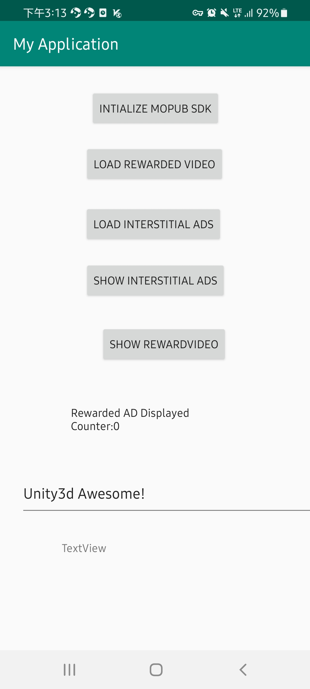

# Unity_Ads-Mopub-mediation
This an Adnsroid Stdio project, which contains below buttons/features:  
○	One button will initialize the MoPub SDK.  
○	One button will load an interstitial ad.  
○	One button will load a rewarded video ad.  
○	One button will show an interstitial ad.  
○	One button will show a rewarded video ad.  
Please check the activity "AppsFlyerTest" for Unity and Mopub SDK integration.

